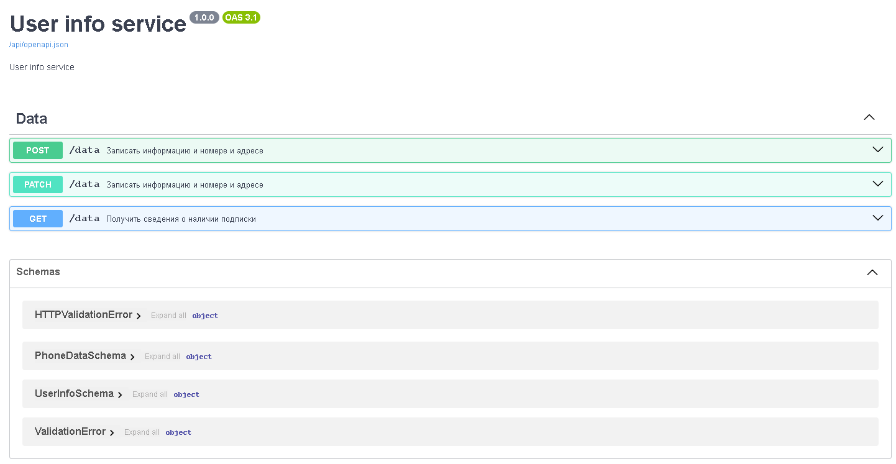

# FastAPI-Redis-ETL

# User info service

Приложение для записи, получения, изменения привязки номера телефона к адресу пользователя

## Running The Server

Рабочая директория `..\FastAPI-redis-etl`

Запустить команду после инициализации `.env` по образцу `env.example`

```bash
docker compose up -d --build
```

## Swagger

Url:

```
   http://localhost:8080/api/openapi
```



## Running tests

Рабочая директория `..\FastAPI-redis-etl\data_app\tests\functional`

Запустить команду после инициализации `.env` по образцу `env.example`

```bash
docker compose up -d --build
```
